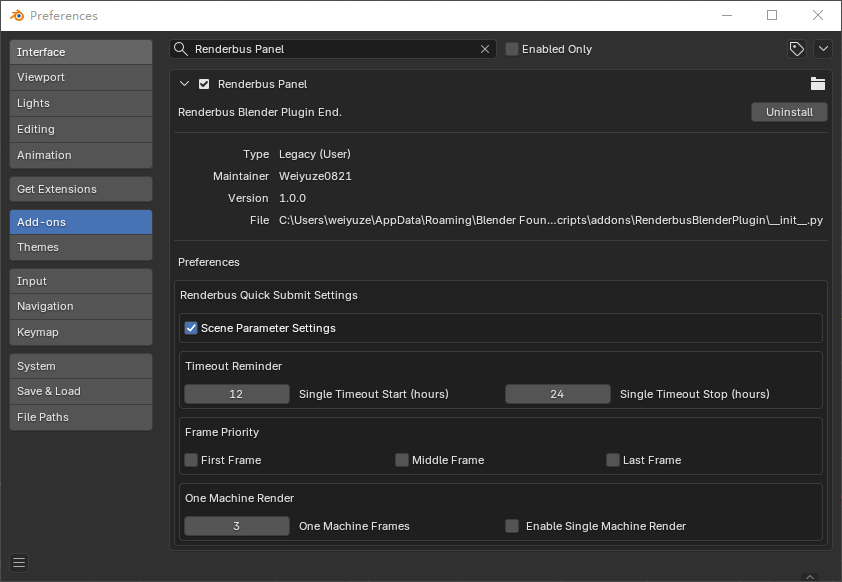
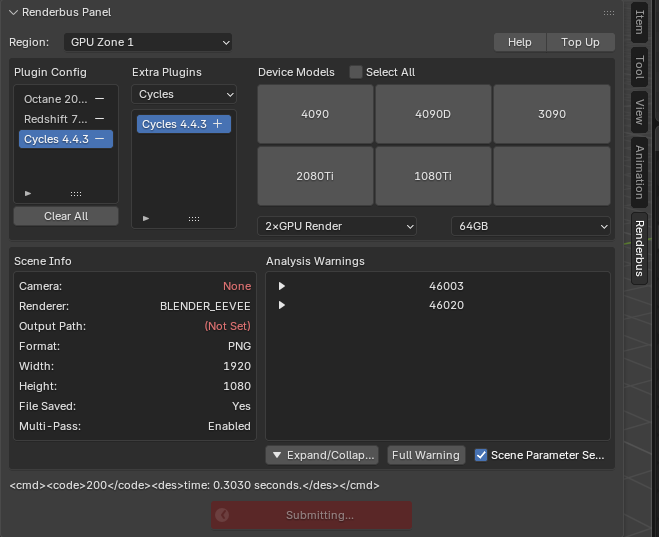
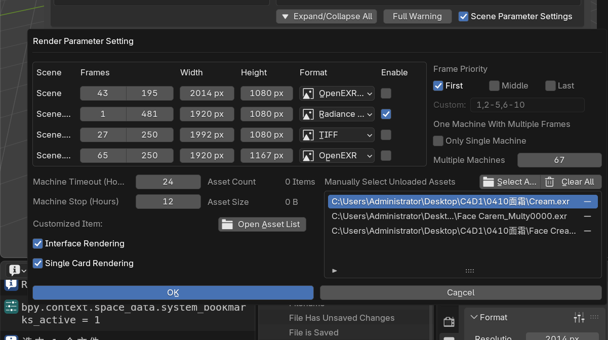

# 2025 年终总结｜魏雨泽（渲染研发部 C4D 组）

> 时间范围：2025 年（入职 2024 年 12 月，2025 年 3 月底转正）

---

## 目录
- [1. 个人介绍](#sec-1)
- [2. 工作内容介绍](#sec-2)
  - [2.1 工单方面](#sec-2-1)
  - [2.2 脚本方面](#sec-2-2)
  - [2.3 工作内容总结](#sec-2-3)
- [3. 2026 年工作规划](#sec-3)
- [4. 部门或工作流程建议](#sec-4)
- [5. 总结词](#sec-5)

---

## 1. 个人介绍

### 1.1 个人信息
- 姓名：魏雨泽
- 部门：渲染研发部 C4D 组
- 入职时间：2024 年 12 月
- 转正时间：2025 年 3 月底

### 1.2 负责工作内容
- 核心工作：处理工单，保障客户问题闭环与平台稳定使用。
- 工单以外：参与软件流程脚本的维护与开发支持；当有功能需求或其他同事需要协助时，参与配合处理相关任务。

### 1.3 当前负责脚本范围
- 主要负责 **Blender / C4D** 流程脚本的：
  - Bug 修复
  - 新功能支持
  - 分析/渲染流程优化与兼容性维护

---

## 2. 工作内容介绍

## 2.1 工单方面

### 2.1.1 工单总量与分布
- 负责软件：C4D / Houdini / Blender

### 工单统计（总数：2413 单）
| 软件 | 占比 | 估算工单数（≈2413×占比） | 占比可视化 |
|---|----:|---:|---|
| C4D | 50% | 1207 | ████████████████████░░░░░░░░░░░░░░ |
| Houdini | 40% | 965 | ████████████████░░░░░░░░░░░░░░░░░░ |
| Blender | 10% | 241 | █████░░░░░░░░░░░░░░░░░░░░░░░░░░░░░ |

- 转正后（2025 年 4 月—年底）工单数量：**2033 单**
- 变化趋势：随着脚本持续优化，越到年底 **日均工单数量越少**，重复性问题明显下降。

### 2.1.2 处理工单的思路与方法
- 高频问题总结：
  - 把经常出现的工单问题记录下来并分类整理
  - 能通过脚本解决的就转成脚本优化项，持续完善，尽量把重复问题变少
  - 比较复杂的工单会写进周报同步给同事，避免大家遇到同类问题反复排查浪费时间
- 快速测试流程：
  - 基于个人看单习惯整理一套常用测试步骤
  - 先用最快路径找到解决办法，覆盖 80%～90% 的常见问题
  - 剩下比较特殊的情况再单独深入排查，定位到具体原因

### 2.1.3 工单经验总结与价值体现
- 处理效率更高：
  - 看单过程中不断总结方法，处理更快，也能腾出时间做脚本维护和开发
- 更容易判断问题属于哪一类：
  - 通过工单积累，能更准确判断哪些是脚本能优化掉的，哪些是场景设置导致的
  - 从工单里反推脚本需要补哪些检查和提示，更贴近客户实际会遇到的问题
- 提前提醒，减少返工：
  - 对于明显是场景设置导致的失败/效果不对，尽量在分析阶段就给出提示，减少客户提交上来失败或者效果不对的工单，优化产能和节约看重复工单的时间
- 重复工单减少，值班更省事：
  - 把能脚本化处理的重复问题持续优化掉，减少同类工单反复出现
  - 长期下来能明显减少工单量（每周/每月可减少十几到二十个左右的重复问题单）

---

## 2.2 脚本方面

### 2.2.1 学习与应用过程（从零基础到参与核心流程）
- 入职初期脚本零基础：
  - 试用期到转正期间学习脚本
  - 制作一系列小工具脚本帮助看单，例如Blender C4D环境配置脚本，C4D OOC定制脚本等，在没有看单工具之前的辅助测试脚本。
- 逐步接入平台流程代码：
  - 5 月：开始处理平台流程代码，先从 Blender 分析流程入手
  - 随后：扩展到 Blender 渲染流程，并逐步覆盖更完整的流程链路
  - 11 月：开始处理 C4D 分析/渲染流程相关代码
  - 12 月：协助包管理项目开发
  - 2026 年 1 月：开始处理 AE 新流程开发

---

### 2.2.2 脚本功能开发统计

### A. Blender

**A1. 开发功能**
- A：能力增强与资产识别
  1. 兼容网页端/客户端多端口
  2. 分析识别 UDIM 贴图
  3. 分析识别 USD 文件
  4. 识别几何节点缓存、流体烟雾模拟缓存
  5. 插件Flip流体模拟缓存支持
- B：版本与生态兼容、流程稳定性
  1. 兼容 Extension 4.2 后插件安装方式；首选项配置错误时直接退出渲染流程
  2. 修复输出文件格式导致任务失败等
  3. 兼容 Blender 5.0 合成节点出图, 新软件版本接口有更改，需要兼容
  4. Wheels 层级插件支持
- C：渲染器支持
  - Blender V-Ray 支持
- D：后管网页定制项支持
  - CUDA / OptiX、单卡、界面渲染、渲染分块尺寸等
- E：资源与计费模式支持
  - 一机多帧渲染一机一扣费支持

**A2. 解决的问题与脚本价值**
- 多端口兼容提升维护性；支持更多文件类型与缓存抓取，减少资产相关工单，提高渲染体验
- 适配新版本 Blender 插件安装与出图方式变化，保证版本升级后可持续支持
- V-Ray 支持满足业务扩展需求，吸收更多客户（尽管当前用户量不高）
- 定制项支持减少客户“修改后重提”成本，可直接修复问题任务
- 支持 Blender 一机一扣费

**A3. 插件端提交开发**
- 首选项偏好设置:
  - 
- 插件软件配置栏:
  - 
- 首选项偏好设置:
  - 

---

### B. C4D

**B1. 开发功能**
- A：修复 RS2025 / 2026 - OCIO 问题
  - 首次修改 C4D 流程脚本：由组长与官方反馈 bug 获取修复方案，我负责落地执行与验证，完成流程适配
- B：稳定性与预警前置
  1. 支持识别客户端灰猩猩插件路径，保证分析/渲染链路完整
  2. OC / RS 多通道设置错误导致失败：保证 `"regular-on": "1"`
  3. 修复 EXR 默认输出 RGBA：改为仅在存在 Alpha 时添加 A，默认输出 RGB
  4. OC 场景设置不正确导致 SAVE 主图颜色被覆盖：增加分析警告
  5. OC AOV 输出 Cryp 通道 格式设置错误导致渲染失败：增加分析警告
- C：模拟资产分析与抓取上传
  - 支持软件内自带特定模拟类型资产分析与自动抓取

**B2. 解决的问题与业务价值**
- C4D 2026 色彩空间变化导致 RS 渲染色彩不正确：修复后可开放 2026 RS，同时覆盖 2025 老色彩空间bug问题
- 通过分析警告前置与资产自动抓取，减少“提交后失败/效果不对”的二次修改与返工，降低工单数量
- 解决模拟丢失效果不对问题，提高一次提交成功率与用户体验

---

#### C. AE

**C1. 当前进展**
- AE 脚本使用 JavaScript：学习新语言并开始开发 AE 分析脚本
- 当前已能分析：
  - 项目设置
  - 合成分辨率等基础信息

**C2. 后续方向**
- 继续开发资产分析能力，并完善 AE 全套分析 / 提交 / 渲染流程。
- 主要先以软件内插件端形式开发，后续再考虑客户端网页端支持

---

### 2.2.3 脚本开发的问题与经验总结

#### 1) 开发遇到的问题
1. 软件API 接口定位不清晰，导致搜索时间成本高：需要花较多时间在官方文档中寻找对应实现接口
2. 自身脚本习惯原因，开始写脚本的时候兼容性覆盖不足：新功能未充分兼容旧版本，测试漏项导致上线后需二次返工
3. 初期存在重复造轮子：已有能力未直接复用，造成时间浪费
4. 提交与合并规范不足：
   - 没有只提交当前定制测试相关改动
   - 后续修改未充分测试就合并
   - 对文件层级结构关注不足
5. 测试成本高且重复：
   - 功能需要跨多个版本反复验证，耗时且重复
   - 新一年计划整理脚本测试流程，推进节点机内自动化测试

#### 2) 开发经验总结
1. 新功能必须有兜底机制，尽量不影响线上运行中的脚本与流程
2. 代码可读性优先：
   - 少嵌套
   - 函数短小且单一职责（一个函数只做一件事）
   - 必要时拆分为 2～5 个小函数
   - 命名清晰，关键步骤写“为什么”的注释，便于维护
3. 复杂需求拆分为可交付步骤：
   - 先分解、逐个实现验证，再组合成完整方案
4. 多使用日志与测试：
   - 关键路径有用例
   - 关键节点有日志，便于回归与排查问题

---

## 2.3 工作内容总结
- 工单与脚本工作相辅相成：
  - 工单处理越多，越能明确脚本需要解决的真实痛点与调用链路
  - 脚本越熟悉，处理工单越高效，定位思路更全面
- 举例：
  - 分析失败：可快速定位到分析脚本的具体逻辑段并修复
  - 渲染失败/效果不对：评估是否可通过脚本定制项或预警机制减少返工
  - 插件未启用：可通过流程检查与兜底机制降低失败率

---

## 3. 2026 年工作规划

1. 继续维护 Blender 与 C4D 脚本：
   - 支持新功能
   - 修复 Bug
   - 优化分析/渲染流程以减少重复性工单
   - 优化配置环境速度 以及想办法兼容疑难杂症问题，提升用户提交的体验
2. 协助部门内开发需求：
   - 有需要参与协作的功能，积极配合完成交付
3. 第一季度完成 AE 提交与渲染流程开发：
   - 上线平台，开放新的软件支持
4. 完善 Blender 插件端提交：
   - 参考 C4D 插件端经验
   - 尽快推动上线（Blender 插件端用户量较大，海外用户更倾向使用软件内提交）
5. 持续学习与能力提升：
   - 软件与脚本双线提升
   - 查漏补缺，巩固已有能力，持续补足短板

---

## 4. 部门或工作流程建议

### 4.1 机器性能相关建议

1. CPU 区内存分配一致性问题
   - 当前 CPU 区机器内存并非严格按选择的 GB 固定分配
   - 选择 64GB 时可能随机分配不同内存机型
   - 测试帧若随机到高内存机器可能正常，但全速阶段随机到低内存机器可能出现低内存失败
   - 建议：内存资源分配策略更稳定/可预期，避免“测试通过但全速失败”的区别

2. GPU 区优质 CPU 机型数量不足
   - 以 C4D 为例：散布克隆较多、使用 VDB 体积等场景，对 CPU 性能差异更敏感
   - 当前可检测到“CPU 性能瓶颈”但平台侧可优化空间有限，只能建议客户调整参数
   - 客户若无法接受性能差异，可能转为本地渲染，影响平台留存与体验
   - 建议：补充部分高性能 CPU 机型资源或优化调度策略，提高复杂场景的可用性

### 4.2 工作流程建议
- 今年感受：组长全年持续在帮助大家提升工单处理效率,优化平台产能等等方面，相较于刚入职来看单的过程，和工单的数量都有很明显的提升，
- 只是我负责的软件的感觉年底比年初要少三分之一多的工单量随着贲哥的看单工具持续迭代，看单效率更提升明显，节省大量时间
- 来年期望：希望看单工具的累计的小需求处理完后，和目前处理的包管理流程弄完，能在配置软件插件方面减少重复的时间，现在配置完一个插件要传到所有区就比较麻烦

---

## 5. 总结词
- 过去一年收获很大：从之前的产品动画岗位转到当前岗位，相当于转行，入职前没有脚本开发经验，但在平台和团队的支持下，我接触并学习了很多新的知识。和以前相比，现在的工作更偏向于定位问题、解决问题，再到脚本实现功能并上线验证，反馈也更直接、更明确。这类反馈让我更有成就感，也让我更愿意投入精力，把我负责的工作做的更好。
- 非常感谢组长：
  - 从入职起在工单与脚本方面倾囊相授，有问必答
  - 目前能够独立维护 Blender 与 C4D 脚本，离不开组长的帮助与指导
- 也感谢部门其他同事：
  - 每个人都或多或少给予支持与帮助，也让我学习到很多
- 新的一年希望能为部门与团队做出更多贡献：
  - 持续学习，保持进步
  - 把工作做得更稳、更快、更可复用

我的年终总结到这里结束，谢谢大家，祝大家新年快乐。
